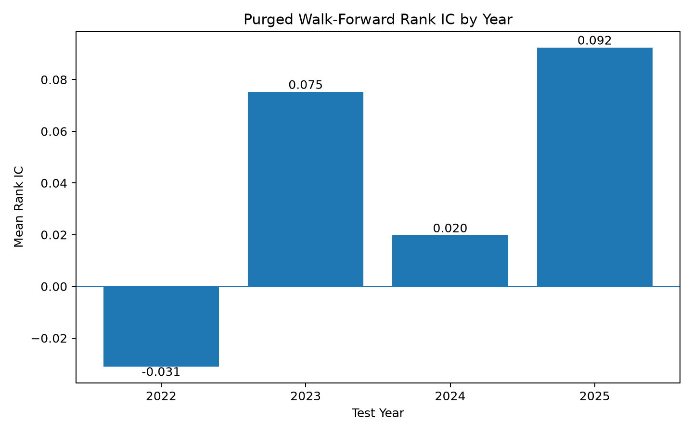
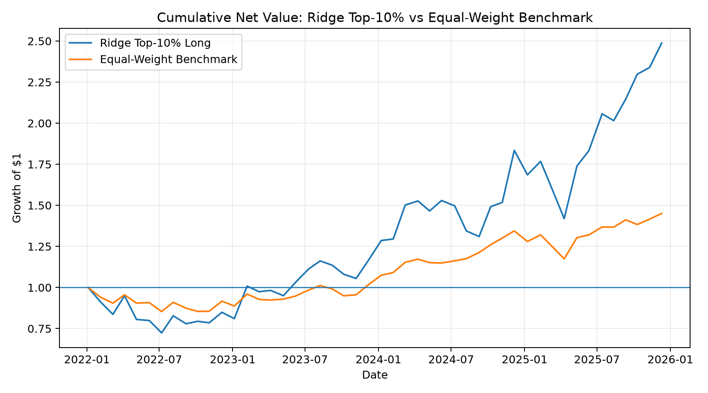

# Machine Learning for Cross-Sectional Return Prediction

A research project on cross-sectional U.S. equity return prediction using
price-derived features, linear and nonlinear machine-learning models, purged
walk-forward evaluation, market-regime diagnostics, and portfolio backtesting.

The main result is that simple volatility features produced more robust
out-of-sample ranking information than broader momentum/trend feature sets or
a nonlinear gradient-boosting model.

## Overview

The project studies whether historical price information can predict the
relative future performance of stocks.

For stock \(i\) at date \(t\), the prediction target is the future 21-trading-day return:

\[
y_{i,t} =
\frac{P_{i,t+21}}{P_{i,t}} - 1
\]

Models are evaluated primarily using daily cross-sectional Rank IC:

\[
\mathrm{RankIC}_t =
\mathrm{Corr}
\left(
\mathrm{Rank}(\hat y_{i,t}),
\mathrm{Rank}(y_{i,t})
\right)
\]

rather than relying only on point-forecast metrics such as MSE or \(R^2\).

## Data

- Approximately 199 U.S. equities
- Historical prices from roughly 2016-2025
- Daily close-price data
- Current constituents are projected backward through history

The last point introduces survivorship / universe-selection bias and is
discussed explicitly in the limitations section.

## Features

The full feature set contains 12 price-derived variables.

### Return and momentum

- 1-day return
- 5-day return
- 21-day return
- 63-day return
- 126-day return
- 126-day momentum with a 5-day skip

### Volatility

- 5-day realized volatility
- 20-day realized volatility
- 63-day realized volatility

### Trend and price position

- 63-day drawdown from rolling high
- 5-day / 21-day moving-average ratio
- 21-day / 63-day moving-average ratio

All features use information available at or before the prediction date.

## Leakage Control

The evaluation uses time-ordered train/test splits rather than random
shuffling.

Because the target itself uses the following 21 trading days, a 21-trading-day
purge window is inserted before every test period so that training labels do
not overlap with the test period.

The main evaluation uses an expanding-window walk-forward design:

```text
Train through 2021 -> predict 2022
Train through 2022 -> predict 2023
Train through 2023 -> predict 2024
Train through 2024 -> predict 2025
```

Feature scaling is fitted on training data only.

## Models

### Ridge Regression

Ridge serves as the primary linear baseline:

\[
\hat y = \beta_0 + \beta^\top x
\]

with L2 regularization.

### Histogram Gradient Boosting

A nonlinear tree-based model was tested to determine whether nonlinearities
and feature interactions improved out-of-sample performance.

They did not consistently improve performance.

## Feature Ablation

Purged walk-forward Mean Rank IC:

| Feature set | Mean Rank IC |
|---|---:|
| Volatility only | **0.0378** |
| All 12 features | 0.0267 |
| Trend / position | 0.0063 |
| Return / momentum | -0.0145 |

The volatility group provided the strongest out-of-sample ranking signal.

Within that group:

| Feature set | Mean Rank IC |
|---|---:|
| vol_5d + vol_20d + vol_63d | **0.0378** |
| vol_63d | 0.0343 |
| vol_20d | 0.0336 |
| vol_5d | 0.0263 |

Adding trend or momentum variables did not improve the volatility-only model.

## Walk-Forward Stability



Volatility-only Ridge Mean Rank IC by year:

| Year | Mean Rank IC |
|---|---:|
| 2022 | -0.031 |
| 2023 | 0.075 |
| 2024 | 0.020 |
| 2025 | 0.092 |

The signal is therefore not stationary: it failed in 2022 but was positive in
the following three test years.

## Volatility Signal Diagnostics

The Ridge coefficients on 5-, 20-, and 63-day volatility remained positive
across successive expanding training windows.

A separate quintile test also showed that the highest-volatility quintile had
higher subsequent 21-day returns on average than the lowest-volatility
quintile:

```text
Q1 future return: 0.58%
Q5 future return: 1.99%
Q5 - Q1 spread:  +1.42%
```

The spread was negative in 2022 and positive in 2023-2025, again highlighting
time variation in the signal.

## Market-Regime Analysis

A Gaussian Mixture Model fitted with EM was used as a diagnostic tool to
identify latent market environments using:

- market-level 21-day return
- average 20-day volatility
- cross-sectional return dispersion

Ridge Rank IC differed substantially across inferred regimes.

However, explicitly adding hard GMM regime labels and regime-feature
interactions to the predictor reduced out-of-sample performance.

This suggests that regimes may help explain model instability without
necessarily improving prediction when directly included as model inputs.

## Portfolio Backtest

Predictions from the volatility-only Ridge model are converted into a
long-only portfolio:

- buy the top 10% of stocks by predicted future return
- equal weight selected names
- 100% gross long exposure
- enter on the trading day after signal formation
- rebalance approximately every 21 trading days
- apply turnover-based transaction costs

### Performance

| Metric | Ridge Top-10% | Equal-Weight Benchmark |
|---|---:|---:|
| CAGR | **26.20%** | 9.96% |
| Annual volatility | 31.98% | 14.33% |
| Sharpe ratio | **0.885** | 0.734 |
| Maximum drawdown | -23.81% | -12.63% |
| Average turnover | 0.613 | 0.022 |
| Total return | **148.77%** | 45.04% |



The selected portfolio substantially outperformed the equal-weight universe,
but also took substantially more risk.

## Risk-Adjusted Comparison

A simple single-benchmark regression gives:

```text
Beta vs equal-weight benchmark:  1.921
Annualized alpha:                8.37%
Correlation:                     0.861
R^2:                             0.742
Information Ratio:               0.848
```

The high beta indicates that a substantial part of the portfolio's higher
return comes from increased exposure to high-volatility / high-market-sensitivity
stocks.

The positive residual alpha suggests additional stock-selection performance
relative to this simple benchmark, but should not be interpreted as fully
factor-adjusted alpha.

## Transaction-Cost Sensitivity

| Cost assumption | CAGR | Sharpe |
|---|---:|---:|
| 0 bps | 26.66% | 0.90 |
| 5 bps | 26.20% | 0.88 |
| 10 bps | 25.74% | 0.87 |
| 20 bps | 24.83% | 0.85 |

The result does not disappear under higher simple transaction-cost assumptions.

## Additional Experiments

Several extensions were tested but did not improve the main model:

- HistGradientBoostingRegressor
- broader 12-feature specification
- cross-sectional rank as the training target
- hard GMM regime-conditioned Ridge interactions

These negative results were retained rather than discarded, since they help
separate genuine incremental information from model complexity.

## Key Findings

1. More model complexity did not automatically improve out-of-sample prediction.
2. More features did not automatically improve prediction either.
3. Volatility features contained the strongest signal among the tested
   price-derived variables.
4. The volatility signal was materially time-varying.
5. The predictive signal translated into portfolio-level performance, but the
   resulting long portfolio had high benchmark beta.
6. Market regimes helped diagnose instability but did not improve prediction
   when directly inserted into the Ridge model.

## Limitations

This project is exploratory research rather than evidence of a deployable
trading strategy.

Important limitations include:

- survivorship bias from using current constituents retrospectively
- repeated use of the 2022-2025 period during model development
- no completely untouched final holdout after feature/model selection
- simplified transaction-cost modeling
- target-to-target turnover rather than fully drift-adjusted portfolio weights
- no bid-ask spread, market-impact, liquidity, borrow, or execution model
- no point-in-time constituent membership
- limited set of price-derived features
- risk adjustment uses a simple equal-weight benchmark rather than a complete
  multi-factor model

## Project Structure

```text
ml-return-prediction/
|
|-- data/
|   |-- prices.csv
|   `-- model_dataset.csv
|
|-- figures/
|   |-- equity_curve.png
|   `-- yearly_rank_ic.png
|
|-- src/
|   |-- build_dataset.py
|   |-- train_ridge.py
|   |-- train_models.py
|   |-- walk_forward.py
|   |-- feature_group_test.py
|   |-- vol_coefficients.py
|   |-- vol_quintile_check.py
|   |-- regime_analysis.py
|   |-- regime_aware_model.py
|   |-- rank_target_test.py
|   |-- portfolio_backtest.py
|   |-- benchmark_compare.py
|   `-- make_figure.py
|
|-- README.md
`-- requirements.txt
```

## Requirements

Core dependencies:

```text
numpy
pandas
matplotlib
scikit-learn
```

## Running

Build the modeling dataset:

```bash
python src/build_dataset.py
```

Run model comparisons:

```bash
python src/train_models.py
```

Run purged walk-forward evaluation:

```bash
python src/walk_forward.py
```

Run feature-group analysis:

```bash
python src/feature_group_test.py
```

Run the portfolio and benchmark analysis:

```bash
python src/portfolio_backtest.py
python src/benchmark_compare.py
```

Generate figures:

```bash
python src/make_figure.py
```

## Research Perspective

The main lesson from the project is not that a particular model reliably
predicts stock returns.

Instead, the experiments show how weak financial signals can depend strongly
on feature representation, evaluation design, market conditions, and risk
exposure.

Simple models and careful out-of-sample diagnostics were often more informative
than increasing model complexity.